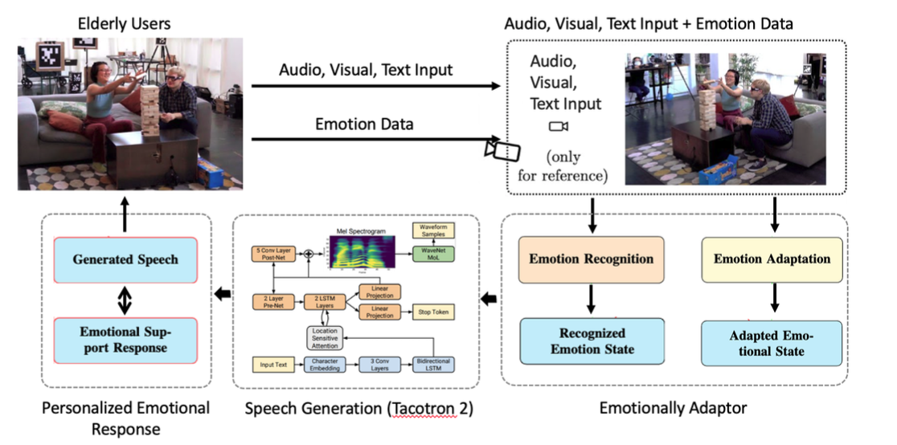

# AdaptiveTTS-Elderly

### Sophie Zhang

Emotional well-being is vital for the quality of life among elderly individuals, who often face challenges such as lone- liness, social isolation, and reduced emotional engagement. Traditional communication technologies often lack the ability to address these emotional needs, resulting in interactions that feel impersonal or disconnected. This paper introduces a novel emotionally adaptive Text-to-Speech (TTS) system specifically designed to enhance communication with the elderly by generating speech that not only conveys information but also empathetically aligns with their emotional states.
Our approach integrates advanced multimodal emotion recognition by capturing and fusing audio, visual, and textual cues to accurately detect nuanced emotional states in real-time. We leverage state-of-the-art deep learning models, including Wav2Vec2.0 for extracting acoustic features from speech, a ResNet-based Convolutional Neural Network (CNN) for analyzing facial expressions, and the LLaMA language model for understanding semantic context from text inputs. These modalities are fused using a multi-head attention mechanism to create a comprehensive emotional profile of the u ser. The core innovation lies in our emotionally expressive speech synthesis pipeline, where we condition a modified Tacotron 2 TTS model with the detected emotional embeddings. This conditioning allows the TTS system to modulate prosody, tone, and speech dynamics to produce responses that are not only contextually appropriate but also emotionally resonant with the user.


## Pre-requisites

1. NVIDIA GPU
2. Python >= 3.7

## Setup
1. Clone this repository
    ```shell
    # SSH
    git clone --recursive git@github.com:sophiezxh/AdaptiveTTS-Elderly.git

    # HTTPS
    git clone --recursive https://github.com/sophiezxh/AdaptiveTTS-Elderly.git
    ```
2. Install python requirements. Please refer [requirements.txt](requirements.txt) for the complete list of dependencies.
    ```shell
    # requirements.txt
    pip install -r requirements.txt
    # CLIP
    pip install EPAlign/CLIP
    ```
3. Download datasets
    - Download and extract the Emotion Speech Dataset (ESD) following the instructions in the official repository [Emotional-Speech-Data](https://github.com/HLTSingapore/Emotional-Speech-Data)
    - Download and extract the Real-world Expression Database (RAF-DB) following the instructions in the official website [Real-world Affective Faces Database](http://www.whdeng.cn/raf/model1.html)
    - Download and extract the [Multimodal EmotionLines Dataset (MELD)](http://web.eecs.umich.edu/~mihalcea/downloads/MELD.Raw.tar.gz)
4. Preprocess the datasets
    - ESD: follow the jupyter notebook [preprocess/ESD.ipynb](preprocess/ESD.ipynb)
    - MELD: follow the jupyter notebook [preprocess/MELD.ipynb](preprocess/MELD.ipynb)
5. Download the Pretrained Models
    - [Waveglow](https://drive.google.com/open?id=1rpK8CzAAirq9sWZhe9nlfvxMF1dRgFbF) for Tacotron2 variant

## Train & Finetune
### Emotion Prompt Alignment Module (EP-Align)
1. Train the model
    
    Follow the jupyter notebook [EPAlign/script/EPAlign_prompt_audio_finetune.ipynb](EPAlign/script/EPAlign_prompt_audio_finetune.ipynb), [EPAlign/script/EPAlign_prompt_vision_finetune.ipynb](EPAlign/script/EPAlign_prompt_vision_finetune.ipynb) and [EPAlign/script/EPAlign_prompt_fuse_finetune.ipynb](EPAlign/script/EPAlign_prompt_fuse_finetune.ipynb)

2. Extract the aligned emotional features
    
    Follow the jupyter notebook [EPAlign/script/extract_emofeature.ipynb](EPAlign/script/extract_emofeature.ipynb)

### Emotion Embedding-Induced TTS (EMI-TTS)

Train the model
    
```shell
# Variant Tacotron2
cd EMITTS/Tacotron2
python train.py --output_directory=ckpt --log_directory=logs --multi_speaker --multi_emotion --emotion_feature
```

## Inference
### Emotion Prompt Alignment Module (EP-Align)
Follow the jupyter notebook [EPAlign/script/EPAlign_inference.ipynb](EPAlign/script/EPAlign_inference.ipynb)
### Emotion Embedding-Induced TTS (EMI-TTS)
  You should train the model to get the checkpoint files and extract the aligned emotional features before inference.
  - For Tacotron2 variant, follow the jupyter notebook [EMITTS/Tacotron2/Tacotron2_variant_inference.ipynb](EMITTS/Tacotron2/Tacotron2_variant_inference.ipynb)

## Acknowledgement

This repository is based on [CLIP](https://github.com/openai/CLIP), [VITS](https://github.com/jaywalnut310/vits), [Tacotron2](https://github.com/NVIDIA/tacotron2), [FastSpeech2](https://github.com/ming024/FastSpeech2), and references the [Pytorch-DDP](https://github.com/pytorch/examples/tree/main/distributed/ddp-tutorial-series), [emospeech](https://github.com/deepvk/emospeech). We would like to thank the authors of these work for publicly releasing their code.

<!-- ## Citation
```
@misc{li2024mmttsunifiedframeworkmultimodal,
      title={MM-TTS: A Unified Framework for Multimodal, Prompt-Induced Emotional Text-to-Speech Synthesis}, 
      author={Xiang Li and Zhi-Qi Cheng and Jun-Yan He and Xiaojiang Peng and Alexander G. Hauptmann},
      year={2024},
      eprint={2404.18398},
      archivePrefix={arXiv},
      primaryClass={cs.CL},
      url={https://arxiv.org/abs/2404.18398}, 
}
``` -->
